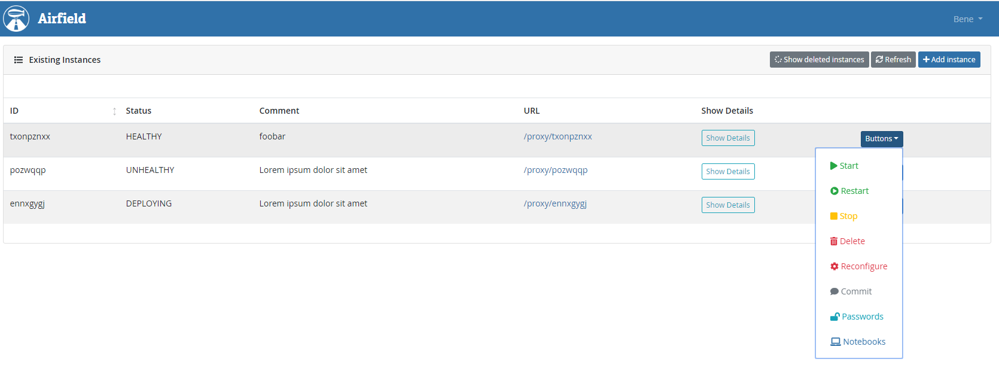

# Airfield
Airfield is an open source tool for the DC/OS ecosystem that enables teams to easily collaborate with shared Zeppelin instances.

The application consists of a micro service written in Flask and a User Interface written in Vue. It was developed and is being maintained by [MaibornWolff](https://www.maibornwolff.de/).

* [Version](#version)
* [License](#license)
1. [Setup](#setup)
    * [Marathon and Marathon-LB](#marathon-and-marathon-lb)
    * [Consul](#consul)
    * [Prometheus](#prometheus)
    * [Optional Settings](#optional-settings)
2. [Deployment](#deployment)
3. [Usage](#usage)
    * [Create new Zeppelin Instance](#create-new-zeppelin-instance)
    * [Modify existing Zeppelin Instances](#modify-existing-zeppelin-instances)
    * [Use a running Zeppelin Instance](#use-a-running-zeppelin-instance)
4. [Further Development](#further-development)
    * [Development Environment with docker-compose](#development-environment-with-docker-compose)
    * [Local Backend](#local-backend)
    * [Local Frontend](#local-frontend)
5. [Roadmap](#roadmap)

#### Version
Airfield is in beta version 0.1b

#### License
Apache License Version 2.0

## Setup
The following setup guide assumes you have a running DC/OS cluster with enough available resources to run both Airfield and some Zeppelin instances.

Airfield depends on a number of third party services that need to be running in your DC/OS environment.
### Marathon and Marathon-LB
The current version of Airfield requires you to have a running Marathon service in your DC/OS environment and have configured the Marathon Loadbalancer (marathon-lb).

### Consul
[Consul](https://www.consul.io/) is used to store:
* available default configurations for Zeppelin Instances
* the Marathon configuration for Zeppelin Instances
* existing Zeppelin Instance data

If the default configurations or the Marathon configuration cannot be found on Consul, then [default values](airfield-microservice/airfield/resources/) will be used.

To configure Consul, set the following environment variable:
* `AIRFIELD_CONSUL_ENDPOINT` - Consul API URL (default: http://localhost:8500/v1/)

The base key is individually configurable, see the [config file](airfield-microservice/config.py) for details.

#### Add Configurations to Consul
If you do not wish to use the [default configurations](airfield-microservice/airfield/resources), then you need to add your preferred configurations to Consul.
The same thing applies for the Zeppelin Deploy Configuration for Marathon.
### Prometheus
[Prometheus](https://prometheus.io/) is used to keep track of important metrics that are generated within the micro service.

The metric names are individually configurable, see the [config file](airfield-microservice/config.py) for details.

### Optional Settings
There a number of optional settings for Airfield, see [config file](airfield-microservice/config.py) for details.

## Deployment
The [deployment script](marathon-deployment.json) is already pre-configured with most details. The following settings need to be specified:

* `AIRFIELD_BASE_HOST` - DC/OS url
* `DCOS_SERVICE_ACCOUNT_CREDENTIAL` - authorize Marathon access with service account. *Recommended option*
* `DCOS_USERNAME` and `DCOS_PASSWORD` - authorize Marathon access with user/password. *Not recommended outside development*

This is not an environment variable, it has to be set in the `labels` category of the deployment script:
* `HAPROXY_0_VHOST` - URL you want Airfield to be reached upon.

Once you have configured the desired settings in the deployment script, you can deploy the application with the DC/OS CLI:

    dcos marathon app add marathon-deployment.json

## Usage
Airfield has a simple user interface that allows to interact with existing Zeppelin instances or create new instances with custom options.
### Create new Zeppelin Instance
Click on the 'Add Instance' button in the main screen to reach the screen depicted below.

Simply select the desired instance type to load its default configuration. You can edit general settings, the spark configuration and specify additional packages to be installed.
### Interact with a running Zeppelin Instance

Airfield lists all existing instances on the main screen. Besides being able to start, stop, restart or delete existing instances, the URL to the instance is also shown.

## Further Development
### Development Environment with docker-compose
This [script](docker-compose-dev.yml) uses docker-compose to set up a local development environment with Consul and Keycloak (OIDC) pre-configured.
The default values for the environment variables have been configured to use these endpoints

You will still need a running DC/OS cluster to deploy your application for testing.
### Local Backend
Install Python 3 and the DC/OS CLI.
```bash
cd airfield-microservice

# Log in to DC/OS
dcos cluster setup dcos-endpoint

# Install dependencies
pip install -r requirements.txt

# Set flask app location and debug mode
export FLASK_APP=app
export FLASK_ENV=development

# Set additional environment variables - see config.py
# Run locally for development
flask run
```

### Local Frontend
Install the latest version of node.js.
```bash
cd airfield-frontend

# Install dependencies
npm i

# Run locally for development with mock server
npm run dev

# Run locally for development with backend server
npm run dev-server

# Build for production
npm run build

# Run ESLint on source files
npm run lint
```

## Roadmap
The current release contains all basic functionality to collaborate with shared Zeppelin instances. Below is a list of future additions that will be included in a next release.

1. Securing the application with OIDC
2. Usability improvements (only show creatable instances, allow adding GPUs to the instance, etc.)
3. Adding notebook templates to be created automatically on instance start
